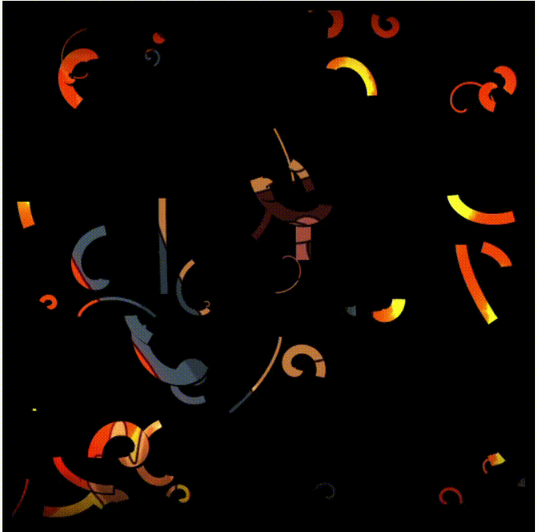

# Complex-animated-code-basis

# Canvas Drawing with Animated Lines

 

This JavaScript code demonstrates how to create an HTML5 canvas and draw animated lines with various colors and patterns. It uses the Canvas 2D API to achieve this effect.

## Getting Started

### Prerequisites

Make sure you have the following prerequisites installed:

- A web browser that supports HTML5 canvas (e.g., Google Chrome, Mozilla Firefox).

### Installation

1. Download the code or clone the repository to your local machine.
2. Open the `index.html` file in your preferred web browser.
3. The canvas will appear on the page, and animated lines will start drawing.

## Usage

This code creates an HTML5 canvas and draws animated lines with the following features:

- Global settings for line width and canvas shadows.
- Gradients for line colors.
- A pattern for line stroke.
- Each line is randomly generated with varying properties, including length, speed, and color.
- Lines continuously change their direction and appearance over time.

## Customization

You can customize various aspects of the animation by modifying the JavaScript code:

- Adjust the number of lines by changing the `numberOfLines` variable.
- Modify the gradient colors in `gradient1` and `gradient2` to achieve different color effects.
- Change the `patternImage` by providing a different image source for the pattern.
- Experiment with different properties of the `Line` class to create unique line behaviors.

## Acknowledgments

This code is inspired by creative canvas animations and is meant for educational purposes and experimentation. Learned with Franks Laboratory

Feel free to explore and modify the code to create your own unique canvas animations!
